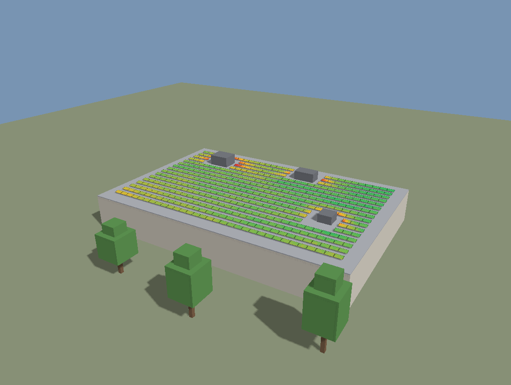
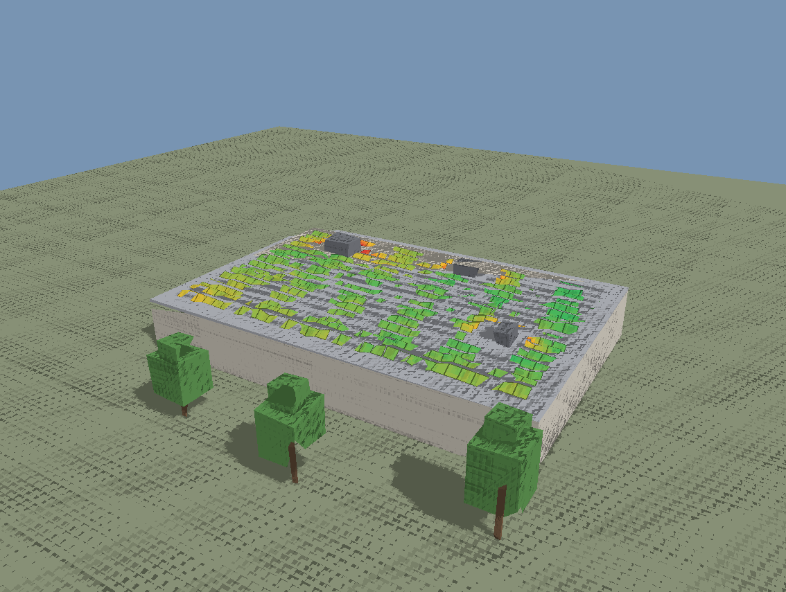

# Annual shading sweep, in WebGPU

A year of solar shading analysis for a 470-module flat-roof array, computed as a
GPU pipeline. Every daylight hour of every month, nine sample points per module:
**613,350 occlusion tests in about 250 ms** on Intel integrated graphics.



Each module is tinted by its own 3×3 sample grid. The amber band along the
south edge of every row is inter-row shading, the modules beside the rooftop
plant are locally obstructed, and the west side loses more to the neighbouring
tower. None of that is drawn in. It falls out of the analysis.

---

## Why I built this

I spent two years on a browser-based solar design tool built on Google's
photorealistic 3D Tiles, doing exactly this analysis in Three.js. There it ran
on CPU worker threads against a bounding volume hierarchy, and a design this
size took **roughly 85 seconds**.

I had looked at LuciadRIA before, and I went back to it properly after seeing
this role. The thing that caught my attention was the 2026.0 release: WebGL is
gone, `WebGLMap` no longer exists, every map is a WebGPU-backed `RIAMap`, and
`webGLContext` has been replaced by `webGPUDevice` and `webGPUContext`. That is
not a version bump, it is a migration.

So I wanted to find out what my own hardest workload looks like when it is
written for WebGPU instead of ported to it. This is that experiment. It took
about two days.

The answer is that it stops being a scheduling problem. On the CPU I spent most
of my effort on worker pool sizing, payload transfer, device capability caps and
fallback paths, all to make 85 seconds tolerable. Here none of that machinery is
needed, because the occlusion test is not a ray cast at all.

## The idea

The sun is a **directional** light. Every ray in a given hour is parallel. So
instead of asking "does this ray hit anything", render the scene's depth once
from the sun's point of view and ask "is this point the closest thing along its
own sun ray". One depth render answers the visibility question for every sample
in the scene simultaneously.

Two passes per hour:

1. **Shadow pass** — rasterise scene depth from the sun's direction into a
   2048² `depth32float` target. There is no fragment stage at all, so it is pure
   rasterisation.
2. **Compute pass** — one invocation per module. It projects nine sample points
   into that depth map, compares, and accumulates the count of samples that
   reached the sun.

145 daylight cells, therefore 290 passes, **submitted as a single command
buffer** and read back once. The whole year is one `submit` and one
`mapAsync`.

That is only possible because the frame uniform is read through a **dynamic
offset**: all 145 sun matrices live in one buffer written in one go. Without
that it would be 145 separate submissions with a stall between each, and the
GPU would spend its time waiting for JavaScript.

## The precision half

The scene is in earth-centred coordinates, so every vertex is about 6,378 km
from the origin. `float32` carries 24 bits of mantissa, so near 6.4 × 10⁶ the
gap between representable values is about **76 cm**. A solar module is 1.7 m
wide.

WGSL has no 64-bit float type. There is no `double` in the shading language, so
this cannot be fixed inside a shader. It has to be fixed before the upload: keep
the big numbers in JavaScript, where they are already `f64`, subtract a render
origin near the scene, and hand the GPU only the offsets.

The sidebar has a toggle for it. Same scene, same shaders, one subtraction
removed:



This is the same discipline LuciadRIA applies when it converts its geocentric
camera into a local topocentric one before handing a frame to three.js, and the
same one I used to place sites in the tool I worked on before.

## Running it

Needs Chrome or Edge 113+, and a secure context. WebGPU refuses to initialise
over plain `http://` on anything but localhost, which is also why LuciadRIA
2026.0 now requires HTTPS.

```
node devserver.js 8099
# then open http://localhost:8099
```

The page computes the year on load, so it opens showing the analysis rather
than an empty grey array waiting to be told what to do. The button re-runs it.

Any static server works; `devserver.js` only exists because it also accepts the
self-test's result, so the pipeline can be verified from a command line:

```
node devserver.js 8099
chrome "http://localhost:8099/index.html?selftest=1"
cat selftest-result.json
```

```json
{"ok":true,"adapter":"intel gen-12lp","panels":470,"cells":145,
 "sampleTests":613350,"meanAccess":0.8813,"worstAccess":0.6728,
 "bestAccess":0.931,"gpuMs":245.7}
```

Add `&precision=absolute` to capture the broken path.

## What is in here

| File | What it owns |
|---|---|
| `src/geo/frame.js` | WGS84 geodetic → ECEF, the local ENU basis, and the render-origin subtraction |
| `src/geo/sun.js` | NOAA solar position, and the 12 × 24 month-hour grid |
| `src/scene/site.js` | The site in local metres: warehouse, plant, tower, trees, and the array with its keep-out zones |
| `src/gpu/shaders.js` | All WGSL. Four programs over one uniform block |
| `src/gpu/renderer.js` | Device, bind group layouts, four pipelines, the frame, the sweep |
| `src/math/mat4.js` | `f64` matrices. The only downcast is `toF32`, deliberately |
| `src/main.js` | Camera in the local frame, controls, readouts |

Bind group layouts are declared explicitly rather than with `layout: 'auto'`,
because four pipelines share these resources and auto layouts would produce four
incompatible sets of them.

## Details worth a second look

**The back-face test comes first.** A module facing away from the sun receives
no direct beam whatever the geometry does. Testing occlusion first and facing
second reports a north-facing module as fully lit at midday. This is why best
access is 93% and not 100%: at low winter sun the sun is behind the module
plane, and that is correctly counted as no direct beam rather than as shade.

**Bias is split.** The sample origin is lifted 5 cm along the module normal, and
the shadow pipelines carry a slope-scaled depth bias. Pushing all of it into the
comparison epsilon instead would mean sizing it for the worst grazing angle,
which would then wash out the 17 cm height difference that produces the
inter-row shading the analysis exists to find.

**The colour ramp is stretched to the data.** Access here spans 67% to 93%. A
fixed 0–100% ramp spends almost all its resolution on values the analysis never
produces and renders a real 26-point spread as one flat green. The legend states
the range it is actually using, because otherwise the colours claim a precision
the scale does not have.

**Lighting is linear, output is encoded.** The canvas format is a plain unorm
target, not an `_srgb` one, so nothing converts on our behalf. Authored colours
are decoded to linear on the way in and the lit result is encoded on the way
out. Skipping that is what makes a scene sit about a stop and a half too dark.
LuciadRIA 2026.0 made the same move to linear colour, and its release notes warn
that rendered output shifts slightly because of it.

**Panels cast shadows on each other.** They are in the shadow pass, drawn with
no face culling, because a single quad with no thickness would otherwise stop
casting for half the year.

**Keep-out zones around the plant.** Without them the layout drops modules
inside an air handler, which then report zero sun for the whole year and drag
the array average down for a reason that is not shading.

## Debugging notes

`tools/inspect.js` attaches to a running Chrome over the DevTools protocol and
reports the page's own diagnostics, the console (which is where WebGPU
validation errors land, since they never reach JavaScript), and a screenshot of
what is actually composited. `tools/transfer.js` clears the canvas to known
values and reads back the pixel the compositor shows, which isolates the canvas
transfer function from anything the shaders are doing.

Both exist because of one bug worth recording. The scene rendered correctly and
looked almost black, and the camera ignored the mouse. The cause was neither
graphics nor input:

```css
#overlay { position: absolute; inset: 0; display: grid; background: rgba(13,16,19,.94); }
```

The error overlay is marked `hidden`, but the user-agent rule for that attribute
is `[hidden] { display: none }`, and an ID selector outranks it. So the overlay
was never hidden. It sat over the canvas as a 94% opaque sheet and swallowed
every pointer event. Reading the texture with `canvas.toDataURL()` showed a
perfectly bright scene, which is what made it look like a shader problem for
much longer than it should have. The measured compositing ratio was 0.106,
against 1.000 after adding `[hidden] { display: none !important; }`.

## What this is not

It is not a LuciadRIA application. LuciadRIA is a licensed SDK and I do not have
a licence, so I built the layer their documented integration path expects: their
own guide has you share `RIAMap.webGPUDevice` with a three.js `WebGPURenderer`
and composite against the map's colour and depth textures. Everything here would
sit on that side of the boundary.

It is also not a replacement for a real irradiance model. This measures **sun
access**, the geometric fraction of direct beam that reaches a module. Turning
that into energy needs a diffuse component, a sky view factor, an incidence
angle model and weather data. In the tool I worked on before, keeping those two
quantities separate mattered a lot: conflating optical access with energy loss
is how a shading figure ends up wrong in a way that still looks plausible.

The geometry is boxes on purpose. The point is the pipeline, not the mesh.
